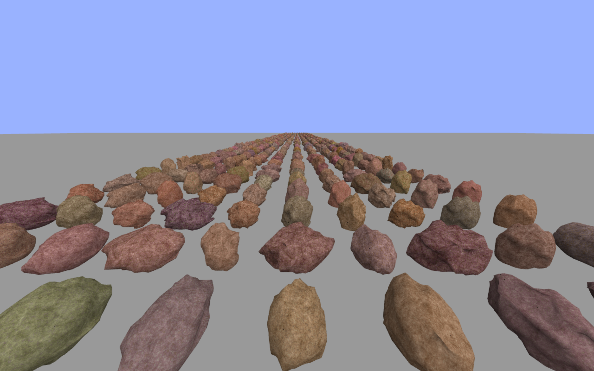

# Procedural Rock Generation using WebGL

In this project, a simple technique for procedurally generating rocks is showcased.



## Demo

Two demos of the technique are provided.

* [Rock Editor](http://erkaman.github.io/gl-rock/example/index1.html)
* [1000 Rocks](http://erkaman.github.io/gl-rock/example/index2.html)

**Note that the second demo will be very taxing on lower-end GPUs!** A [Video](https://www.youtube.com/watch?v=PX9lU_IqcT4) is provided in case your GPU is too weak.

### 1000 Rocks

The camera in the demo is controlled as follows:

* Keys `W` and `S` are used to walk forward and backward.
* Keys `A` and `D` are used to stride left and right.
* Keys `O` and `L` are used to fly up and down.
* Hold down the key `M` to speed up the camera.
* Hold down the left mouse button and move the mouse to turn the camera.


### Rock Editor

If you are modifying the mesh parameters(The "edit mode" is "mesh"), then the mesh will not update real-time. You must click the button "Update Rock", or the keyboard key "P", in order to update the rock. 

Next, we explain some parameters of the rock editor. For more details on these parameters, see the  [Explanation](https://github.com/Erkaman/gl-rock#explanation) 

* `Noise Scale` controls the scale of the noise that is applied after all the scraping has been done.
* `Noise Strength` controls the strength(amplitude) of the above noise.
* `Scrape Count` controls how many times the mesh is scraped(flattened)
* `Scrape Min Dist` The minimum distance between all the randomly selected spots that are scraped.
* `Scrape Radius`.  Randomly selected spot are selected for scraping. All vertices that are within the distance `Scrape Radius` from that spot are also affected by the scraping.
* `Scrape Strength` How deeply we should scrape.


## Explanation.

In this section, our technique for procedurally generating rocks is outlined.

The general idea is simple: If you look at rocks in nature, you will notice that they are round at some places, and flat at other places. We can reproduce this shape by first starting with a sphere mesh:


and then randomly scraping off parts(flattening) off this mesh, while leaving other parts untouched:


This is easy to implement. To randomly scrape some part of the sphere, we first randomly define a plane:


Now, all vertices that are on one side of the plane are left untouched, but the vertices on the other side are projected onto the plane:


And we can easily project vertices onto a plane by using some elementary linear algebra. 

But by using this approach, we cannot create concave rocks. However, by slightly modifying the approach, we can do this as well. Instead of defining a plane in 3D space, we define a circular disk in 3D space:


Just like before, we now project all vertices under this disk onto the disk. However, we make sure that all vertices that are too far from the center of the disk are left untouched. By doing this, the vertices are projected onto a disk, and we can also create concave rocks:


For more details, see the source code in `example/scrape.js`.


Once we have randomly scraped the sphere mesh, we use a Perlin noise to randomly distort the vertices a little bit. Finally, the rock texture is then generated with a Perlin noise in a fragment shader. This means that we are basically generating the texture in real time, which, unfortunately, also means that it is very taxing to render the rock on lower-end GPUs.

## Build

To run the demos locally on your computer, first change your directory to the directory of the project, then run

```bash
npm install
```

To then run demo 1, do this:

```bash
budo --verbose example/index1.js -t glslify --live --open
```

and the demo will automatically open in a tab in your browser.(but you must install [budo](https://github.com/mattdesl/budo) for this to work). 

To run demo 2, do this:

```bash
budo --verbose example/index2.js -t glslify --live --open
```


## TODO

* It would be nice if the generated rocks could be exported to some external format such as `.ply` or `.obj`.
* Add Ambient Occlusion.


